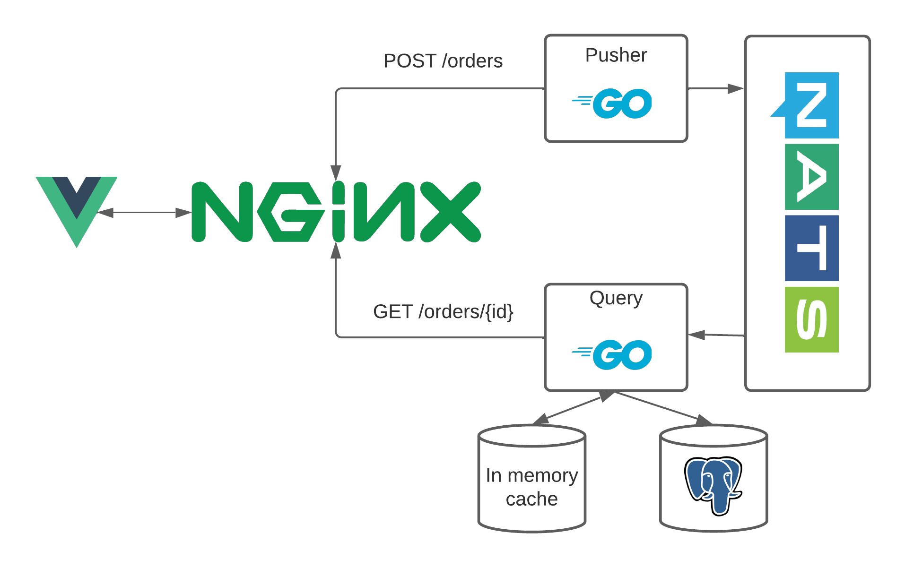
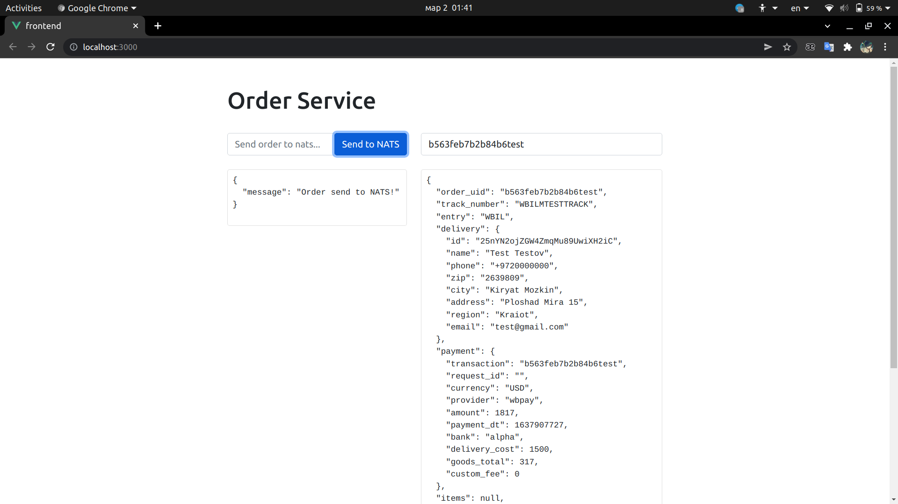

# L0
## Order service

1. Подключение и подписка на канал в nats-streaming
2. Полученные данные писать в Postgres
3. Так же полученные данные сохранить in memory в сервисе (Кеш)
4. В случае падения сервиса восстанавливать Кеш из Postgres
5. Поднять http сервер и выдавать данные по id из кеша
6. Сделать простейший интерфейс отображения полученных данных, для
   их запроса по id

Здесь есть два сервиса. Сервис `Pusher` предоставляет конечную точку в виде HTTP POST для создания заказов.
Сервис `Query` слушает события и вставляет заказы в базу данных Postgresql.

## Разворачивание для разработки (docker)
`docker-compose up -d --build`

`cd frontend && yarn serve`

## Интерфейс
